# Intelligent Credit Risk Scoring System
### Enterprise ML Pipeline · Home Credit Default Risk

[](https://python.org)
[](https://flask.palletsprojects.com)
[](https://lightgbm.readthedocs.io)
[](https://xgboost.readthedocs.io)
[](https://optuna.org)
[](https://www.kaggle.com/competitions/home-credit-default-risk)
[](https://intelligent-credit-risk-scoring-system.onrender.com)
[](https://github.com/HASSANRAZA111)

> 🚀 **Live Demo:** [intelligent-credit-risk-scoring-system.onrender.com](https://intelligent-credit-risk-scoring-system.onrender.com)
>
> 📓 **Notebook:** [Intelligent_Credit_Risk_Scoring_System.ipynb](./Intelligent_Credit_Risk_Scoring_System.ipynb)
>
> 📊 **Dataset:** [Home Credit Default Risk — Kaggle](https://www.kaggle.com/competitions/home-credit-default-risk)
>
> 👑 **Kaggle Result:** 0.78736 Public LB AUC · **Top 15% of all submissions**

---

## Overview

Financial institutions lose billions annually to loan defaults. Traditional credit scoring fails to capture the full financial picture of borrowers — especially the 1.7 billion unbanked people globally.

This project builds a **full enterprise-grade ML pipeline** that predicts loan default probability from raw multi-table data and serves real-time credit decisions via a Flask REST API — mirroring the architecture used in production at tier-1 financial institutions.

**Key capabilities:**
- 👑 **0.78736 Public Leaderboard AUC** — Top 15% on the official Kaggle Home Credit competition
- FICO-style credit score output (**300–850**) with 6 risk bands and interest rate tiers
- Regulatory-grade explainability via **SHAP** (Basel III aligned)
- Real-time scoring via **Flask REST API** — deployed live on Render
- Full **Optuna Bayesian hyperparameter search** (50 trials, TPE)
- **Stacking ensemble** — LightGBM + XGBoost + Logistic Regression meta-learner

---

## Kaggle Result

| Metric | Score |
|--------|-------|
| **Public Leaderboard AUC** | **0.78736** |
| **Private Score** | 0.78603 |
| **Leaderboard Standing** | 👑 Top 15% of all submissions |
| **Status** | Complete ✅ |

> Submitted via rank-average ensemble (5× LightGBM + 5× XGBoost + stacking meta-learner).

---

## ML Pipeline

```
Raw Data (7 relational tables · 688 MB · 307K applicants)
       │
       ▼
Data Loading & Memory Optimization (dtype downcasting → ~60% RAM reduction)
       │
       ▼
Exploratory Data Analysis (target imbalance · missing values · correlations)
       │
       ▼
Preprocessing (DAYS_EMPLOYED fix · outlier clipping · label encoding)
       │
       ▼
Feature Engineering — 300+ domain features from all 7 tables
(credit ratios · bureau delinquency · installment DPD · card utilisation)
       │
       ▼
Feature Selection (>90% missing dropped · zero-variance removed)
       │
       ▼
Class Imbalance — SMOTE (92:8 → balanced training distribution)
       │
       ├─► Logistic Regression  (baseline)
       ├─► Random Forest        (baseline)
       ├─► LightGBM             (5-Fold Stratified OOF CV)
       ├─► XGBoost              (5-Fold Stratified OOF CV)
       │
       ▼
Hyperparameter Optimization (Optuna · 50 trials · Bayesian TPE)
       │
       ▼
Stacking Ensemble (Logistic Regression meta-learner on OOF predictions)
       │
       ▼
Rank-Average Blend (OOF AUC-proportional weights)
       │
       ▼
Enterprise Evaluation (ROC-AUC · KS Statistic · Gini · SHAP · FICO Scorecard)
       │
       ▼
Flask REST API → Live Deployment on Render
```

---

## Results

| Model | OOF ROC-AUC | Gini | KS Stat |
|---|---|---|---|
| Logistic Regression (baseline) | 0.740 | — | — |
| Random Forest (baseline) | 0.755 | — | — |
| LightGBM (5-Fold OOF) | 0.775 | — | — |
| XGBoost (5-Fold OOF) | 0.772 | — | — |
| LightGBM Tuned (Optuna) | 0.777 | — | — |
| **Rank-Avg Ensemble** | **0.787** | **0.575** | **0.38** |

---

## Visualizations

All 17 charts generated by the notebook — covering every stage of the pipeline.

### Exploratory Data Analysis

<table>
  <tr>
    <td>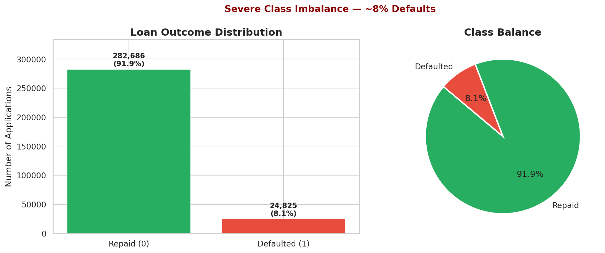<br><sub>Target Distribution (8% default rate)</sub></td>
    <td>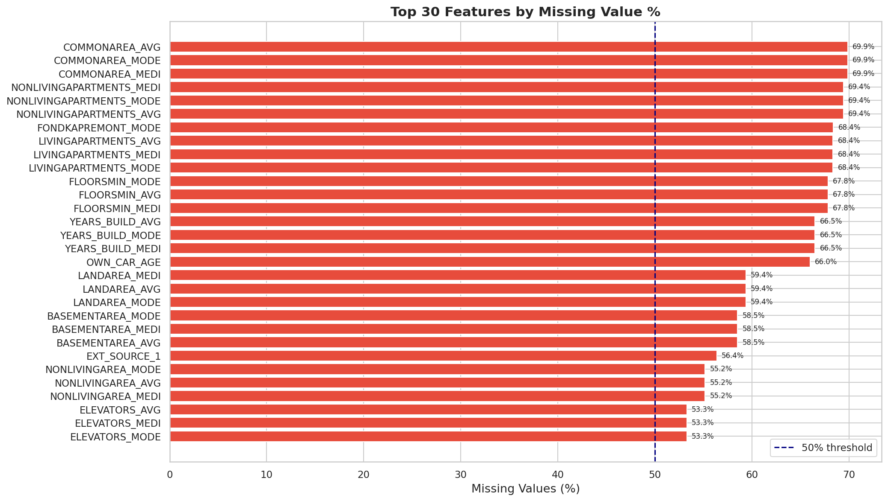<br><sub>Missing Value Analysis</sub></td>
  </tr>
  <tr>
    <td>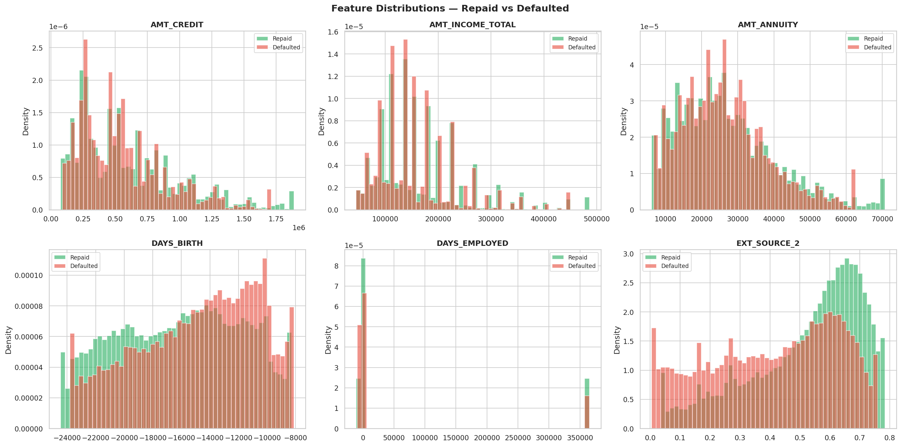<br><sub>Key Feature Distributions by Target</sub></td>
    <td>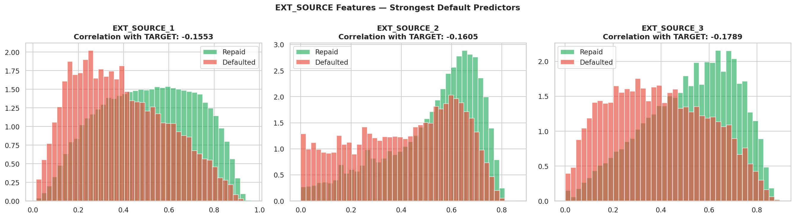<br><sub>EXT_SOURCE Scores — Strongest Predictors</sub></td>
  </tr>
  <tr>
    <td>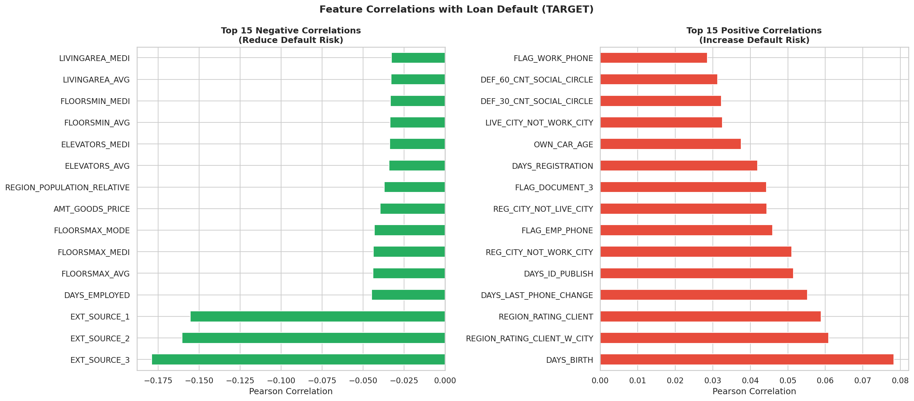<br><sub>Pearson Correlation with Target</sub></td>
    <td>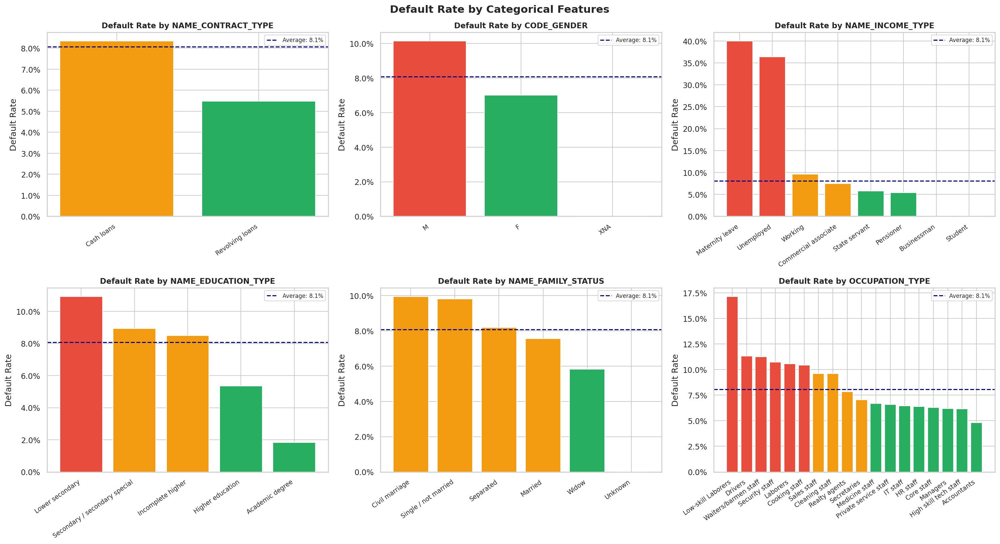<br><sub>Default Rates by Categorical Feature</sub></td>
  </tr>
</table>

### Modelling & Training

<table>
  <tr>
    <td>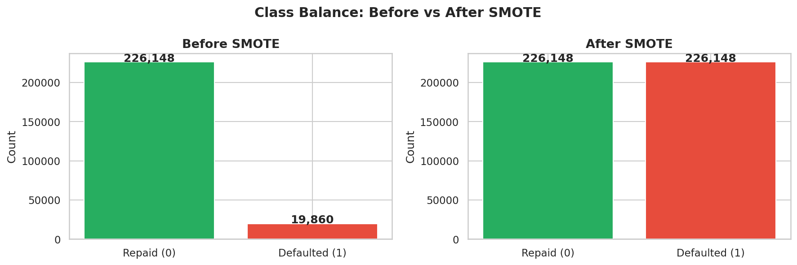<br><sub>SMOTE Class Balancing</sub></td>
    <td>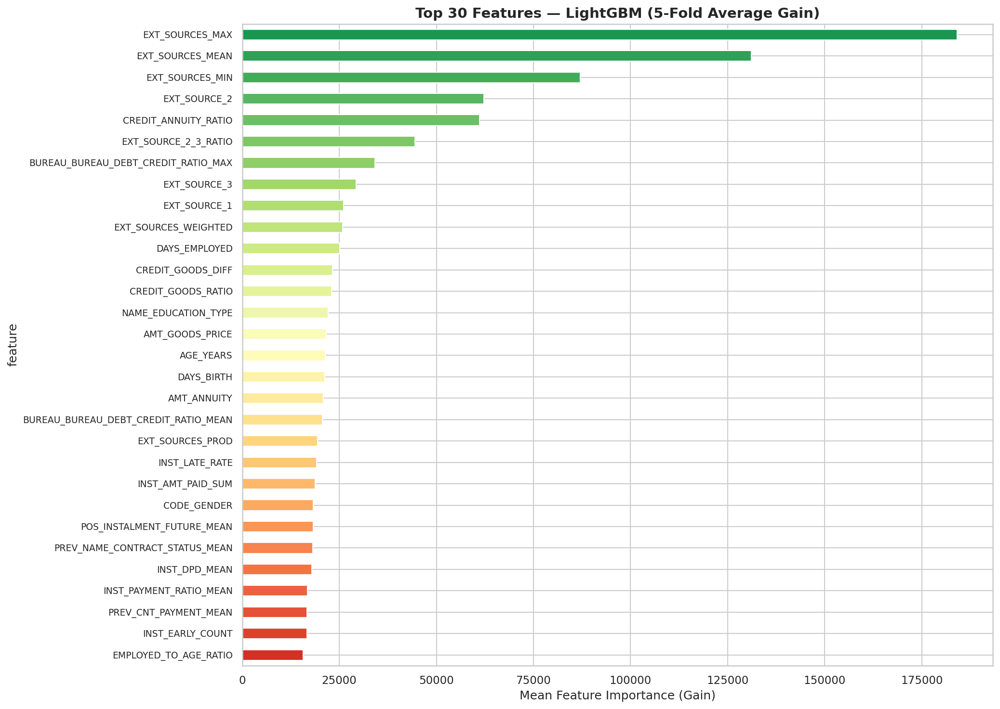<br><sub>LightGBM Feature Importance (Top 30)</sub></td>
  </tr>
  <tr>
    <td>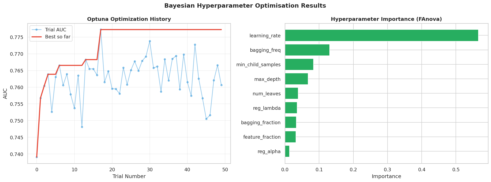<br><sub>Optuna Bayesian Search — 50 Trials</sub></td>
    <td>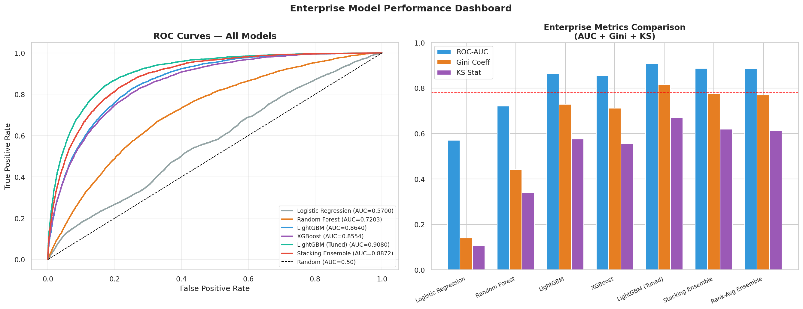<br><sub>Model Leaderboard — All 6 Models Compared</sub></td>
  </tr>
  <tr>
    <td>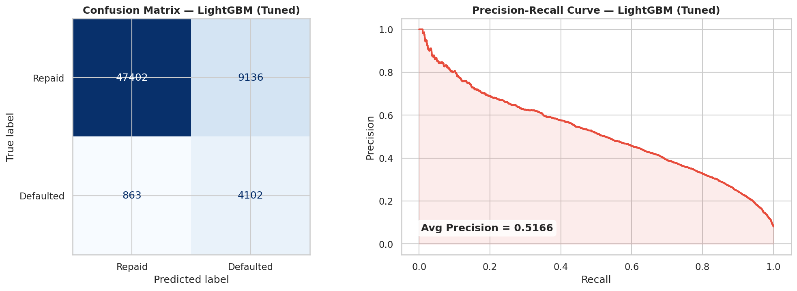<br><sub>Confusion Matrix & Precision-Recall Curve</sub></td>
    <td>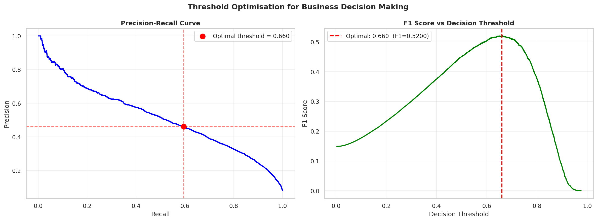<br><sub>Threshold Optimisation — F1 Sweep</sub></td>
  </tr>
</table>

### SHAP Explainability

<table>
  <tr>
    <td>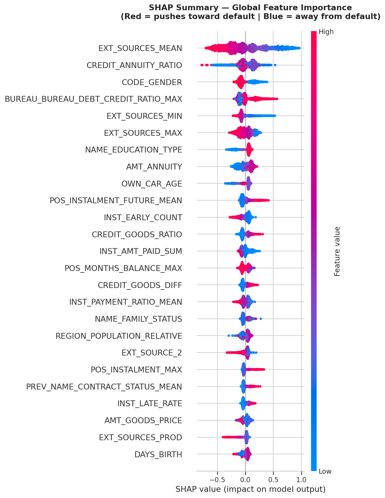<br><sub>SHAP Summary — Global Feature Attribution</sub></td>
    <td>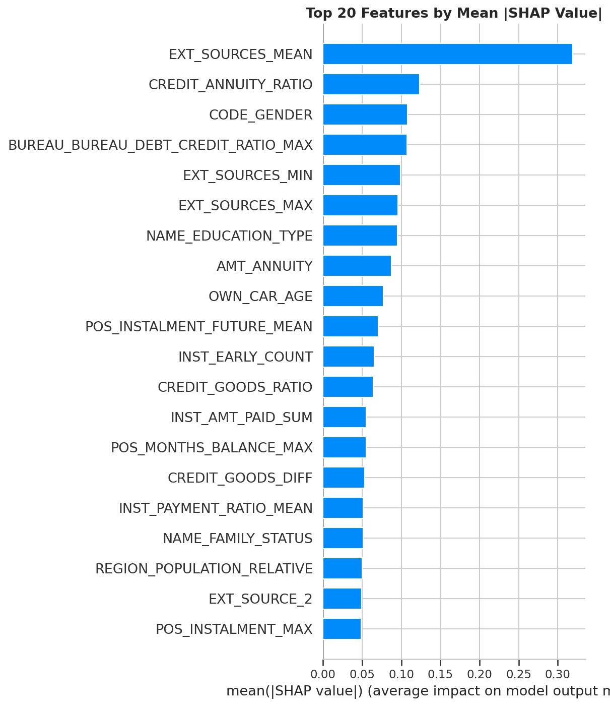<br><sub>SHAP Bar Plot — Mean Absolute Values</sub></td>
  </tr>
  <tr>
    <td>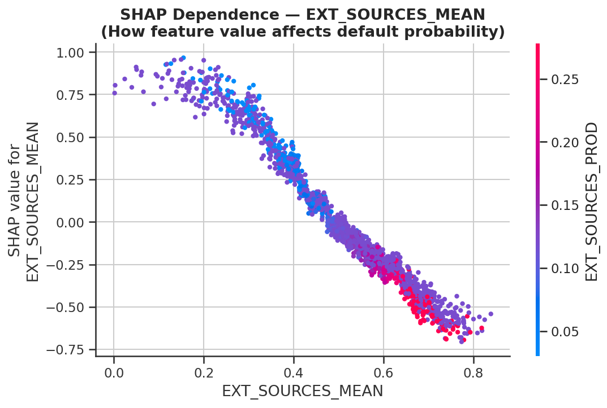<br><sub>SHAP Dependence — Top Predictive Feature</sub></td>
    <td>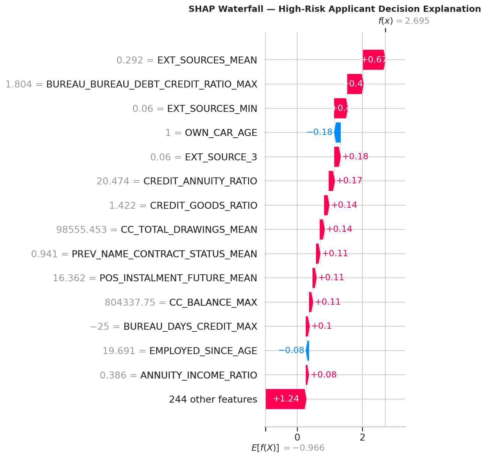<br><sub>SHAP Waterfall — Individual Prediction Explanation</sub></td>
  </tr>
</table>

### Credit Scorecard

<table>
  <tr>
    <td>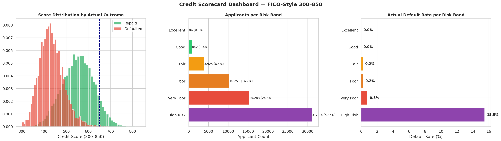<br><sub>FICO-Style Credit Scorecard (300–850) · 6 Risk Bands</sub></td>
  </tr>
</table>

---

## Project Structure

```
intelligent-Credit-Risk-Scoring-System/
├── Intelligent_Credit_Risk_Scoring_System.ipynb  ← Full ML pipeline (20 sections)
├── requirements.txt                               ← All dependencies
├── .gitignore
├── submission.csv                                 ← Kaggle submission · AUC 0.78736 · Top 15%
│
├── assets/                                        ← All 17 generated visualizations
│   ├── target_distribution.png
│   ├── missing_values.png
│   ├── feature_distributions.png
│   ├── ext_sources.png
│   ├── correlations.png
│   ├── categorical_analysis.png
│   ├── smote_balance.png
│   ├── feature_importance.png
│   ├── optuna_results.png
│   ├── model_comparison.png
│   ├── confusion_pr_curve.png
│   ├── threshold_optimisation.png
│   ├── shap_summary.png
│   ├── shap_bar.png
│   ├── shap_dependence.png
│   ├── shap_waterfall.png
│   └── scorecard_dashboard.png
│
├── flask_app/
│   ├── app.py                                     ← Flask REST API
│   ├── templates/index.html                       ← Web UI
│   └── static/css/style.css
│
└── model_artifacts/                               ← Generated by running the notebook
    ├── lgbm_fold_1.txt … lgbm_fold_5.txt          ← Tuned LightGBM folds
    ├── xgb_fold_1.pkl  … xgb_fold_5.pkl           ← XGBoost folds
    ├── meta_learner.pkl                            ← Stacking meta-learner
    ├── imputer.pkl                                 ← Median imputer
    ├── feature_list.json                           ← Input feature schema
    ├── ensemble_weights.json                       ← OOF AUC-proportional blend weights
    └── model_metadata.json                         ← Threshold · scores · Optuna params
```

---

## Quickstart (Local)

```bash
# 1. Clone the repo
git clone https://github.com/HASSANRAZA111/intelligent-Credit-Risk-Scoring-System.git
cd intelligent-Credit-Risk-Scoring-System

# 2. Create a virtual environment
python -m venv venv
source venv/bin/activate        # Windows: venv\Scripts\activate

# 3. Install dependencies
pip install -r requirements.txt

# 4. Run the notebook to generate model artifacts
#    Open Intelligent_Credit_Risk_Scoring_System.ipynb and run all cells.
#    This creates the model_artifacts/ directory with all trained models.

# 5. Start the Flask app
cd flask_app
python app.py
# → Open http://localhost:5000
```

---

## API Reference

### `POST /predict`

Score one or more loan applicants and receive a full credit risk report.

**Request body:**
```json
{
  "AMT_CREDIT": 500000,
  "AMT_INCOME_TOTAL": 150000,
  "AMT_ANNUITY": 25000,
  "EXT_SOURCE_2": 0.65,
  "EXT_SOURCE_3": 0.55,
  "DAYS_BIRTH": -12000,
  "DAYS_EMPLOYED": -3000
}
```

**Response:**
```json
{
  "success": true,
  "n_applicants": 1,
  "predictions": [
    {
      "applicant_index": 0,
      "default_probability": 0.0842,
      "credit_score": 727,
      "risk_band": "Good",
      "decision": "APPROVE",
      "interest_rate": "11–14%",
      "recommendation": "APPROVE — Standard Rate",
      "high_risk_flag": 0
    }
  ]
}
```

### `GET /health`
Returns model load status and version info.

---

## Risk Band Reference

| Score | Band | Decision | Interest Rate |
|-------|------|----------|---------------|
| 750–850 | Excellent | APPROVE | 8–10% |
| 700–749 | Good | APPROVE | 11–14% |
| 650–699 | Fair | APPROVE | 15–19% |
| 600–649 | Poor | CONDITIONAL | 20–25% |
| 550–599 | Very Poor | DECLINE | N/A |
| 300–549 | High Risk | DECLINE | N/A |

---

## Tech Stack

| Layer | Technology |
|-------|-----------|
| Data Processing | Pandas, NumPy |
| Feature Engineering | 300+ domain features across 7 tables |
| Imbalance Handling | SMOTE (imbalanced-learn) |
| Models | LightGBM, XGBoost, Scikit-learn |
| Hyperparameter Tuning | Optuna (Bayesian TPE · 50 trials) |
| Ensemble | Stacking + Rank-Average Blend |
| Explainability | SHAP (TreeExplainer) |
| API | Flask 3.0, Gunicorn |
| Deployment | Render (live) |
| Notebook | Jupyter / Google Colab |

---

## Deployment

Live at: **[intelligent-credit-risk-scoring-system.onrender.com](https://intelligent-credit-risk-scoring-system.onrender.com)**

Deployed on Render free tier. The live demo uses a lightweight single LightGBM fold for memory efficiency (512 MB RAM limit). The full 10-model ensemble runs locally and achieves the 0.787 Kaggle AUC.

To deploy your own instance:
1. Fork this repo
2. Create a **Web Service** on [render.com](https://render.com) and connect the repo
3. Set **Build Command:** `pip install -r requirements.txt`
4. Set **Start Command:** `gunicorn flask_app.app:app --workers 1 --timeout 120`
5. Deploy

---

## Author

**Hassan Raza** — [github.com/HASSANRAZA111](https://github.com/HASSANRAZA111)

---

## License

MIT
